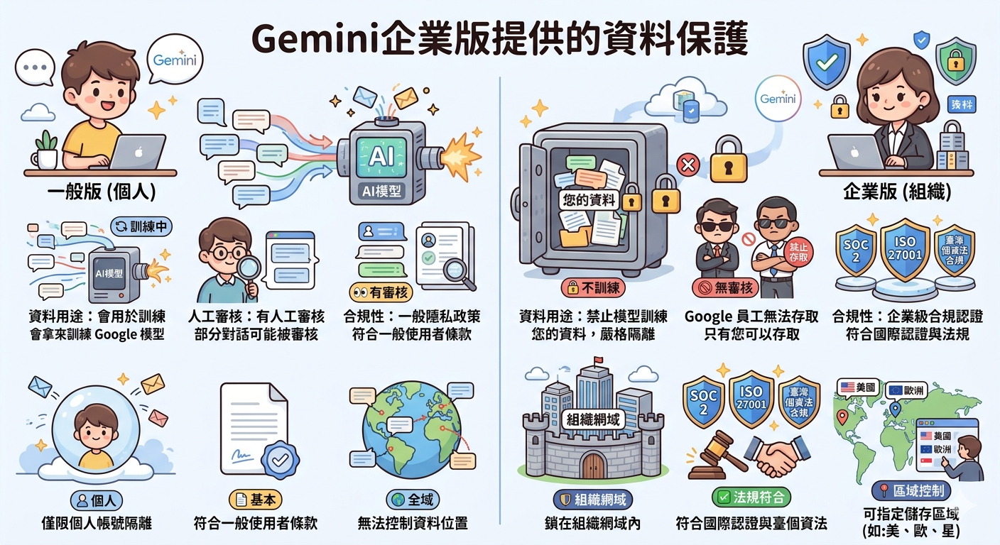
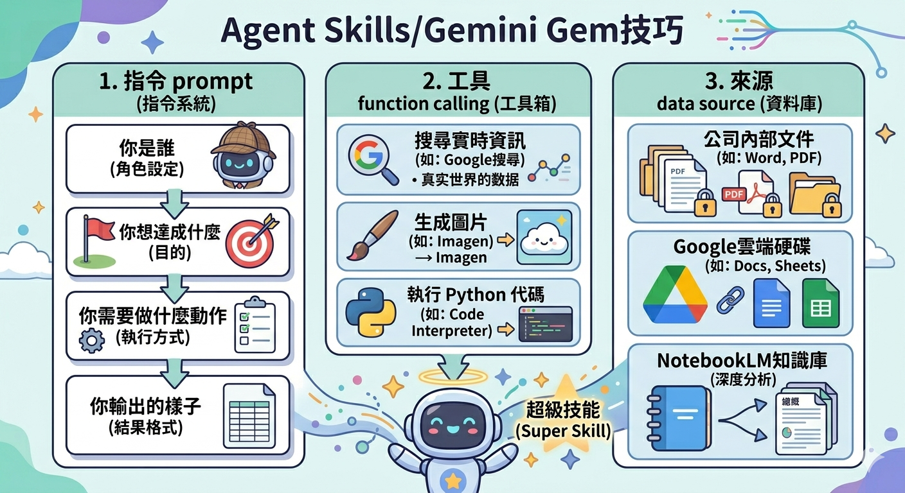

# 交通部資訊主管研習會 - 額外分享
## 一、AI方案選擇分享
1. 自建算力: 貴很多、內部技術門檻、主機世代更迭
2. 三大公有雲算力: 微軟copilot、AWS、Google Gemini
  - ⚠️法規: 僅金管會境內限制
  - ⚠️Why Google Gemini
  - ⚠️Why企業版:



---

## 二、Google Gemini技巧
- ⚠️ 一次性prompt
```
整理高雄港、基隆港、臺中港、花蓮港、安平港、布袋港、澎湖港(馬公)、蘇澳港、台北港各三則發佈日期2日內最新新聞
，列成表格並顯示為正負面。表格欄位包括：港口名稱、新聞標題、內容摘要、正面／負面、發佈日期
```

- ⚠️ 重複性Prompt(定時執行
```
每天早上07:00
整理高雄港、基隆港、臺中港、花蓮港、安平港、布袋港、澎湖港(馬公)、蘇澳港、台北港各三則發佈日期2日內最新新聞
，列成表格並顯示為正負面。表格欄位包括：港口名稱、新聞標題、內容摘要、正面／負面、發佈日期
```

- ⚠️ 重複使用的Gem / Skills




```
你是一個資深的外語商業翻譯資深專家，在港口及科技應用領域特別熟悉
當我貼上外語的內容的時候
你會提供我通順、專業的中文翻譯，以及預擬回信的內容
中文的部份務必使用正體中文、臺灣用語
用語專業、正式

第一句一定會先說「帥哥您好，我是您專屬的外文翻譯秘書」


格式參考
# 一、文章摘要
1. 來信者
2. 來信重點主題

# 二、原文翻譯
# 三、回信預擬(中文版)
# 四、回信預擬(外文版)
```
[外語秘書範例Gem](https://gemini.google.com/gem/1nDKhrShNrno-MvDaM0VHxiTVIsdPBGYM?usp=sharing)


```
Dear Lin,

I hope this email finds you well.

On behalf of the Singapore Tourism Bureau, I am writing to formally express our interest in establishing a strategic partnership with Port of Kaohsiung through a Memorandum of Understanding (MOU).

As Singapore continues to strengthen its position as a global premier cruise and maritime hub, we recognize the pivotal role that [Port Name] plays in regional connectivity and tourism infrastructure. We believe that a formalized collaboration between our organizations would create significant synergies, particularly in the following areas:

Cruise Tourism Development: Jointly promoting fly-cruise packages and enhancing the appeal of regional cruise itineraries.

Infrastructure & Innovation: Sharing best practices in sustainable port operations and digitalizing the passenger experience.

Marketing & Promotion: Co-branding initiatives to drive international visitor arrivals to both destinations.

Knowledge Exchange: Facilitating professional workshops and talent development programs within the maritime tourism sector.

We have prepared an initial draft framework for the MOU and would welcome the opportunity to discuss this proposal further via a virtual meeting or a formal visit. Please let us know your availability in the coming weeks for a preliminary discussion.

Thank you for considering this proposal. We look forward to the possibility of working closely with your team to drive the future of maritime tourism.

Warm regards,

Wang
Director
Singapore Tourism Bureau
```
